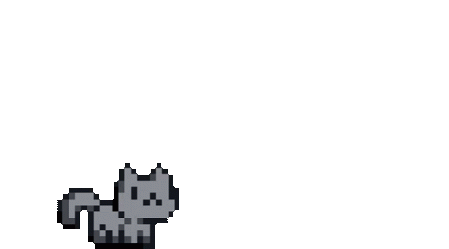

<h1><b>Hi there!  ˗ˏˋ ★ ˎˊ˗</b></h1>

⭐️ I'm Clara, a Computer Science student at Virginia Tech. Here's what I'm currently up to:   
👩‍💻 Learning: JavaScript, React, Node, Blender, Three (essentially, frontend)   
🧚🏻‍♂️ Interested in: full-stack, creative web dev, human-computer interaction, and AI/ML   
🐿️ Things I like to do outside of programming: crochet, take pictures of squirrels, video games (lately Animal Crossing & Valorant), and gym   
💐 Motto: learn by <b>doing</b>, lead through <b>example</b>, and stay <b>curious</b>  

